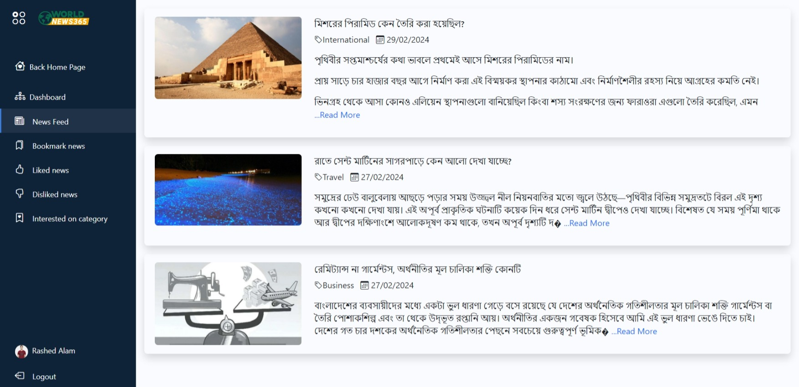

# NEWS APPLICATION

The NEWS APPLICATION is a dynamic news portal site.

## Installation Proccess
[Download the Project](https://github.com/code-with-Rashed/news/archive/refs/heads/master.zip)  

### Command line instruction 

- Insure composer is installed in your computer.

- To open the terminal in your project directory.  
then run this commands.

### install required packages

```
composer install
```

### Create .env file  

```
cp .env.example .env
```

### Create application key  

```
php artisan key:generate
```

### Set Environment Variables  
- To open the .env file.  
- You have to fill your database credentials.  
For Example...  

```
DB_CONNECTION=mysql
DB_HOST=127.0.0.1
DB_PORT=3306
DB_DATABASE=
DB_USERNAME=root
DB_PASSWORD=
```

### Migrate Database  

```
php artisan migrate:fresh
php artisan db:seed
```
### Run Application  

```
php artisan serve
```

### Admin panel (dummy) credentials
- Hit this link http://yourhostname/admin/login

| Role         | Email              | Password |
|--------------|--------------------|----------|
| admin        | admin@news.com     | 12345    |
| moderator    | moderator@news.com | 12345    |
| writer       | writer@news.com    | 12345    |


### Required / key Features


### erdiagram live link
<iframe width="100%" height="500px" style="box-shadow: 0 2px 8px 0 rgba(63,69,81,0.16); border-radius:15px;" allowtransparency="true" allowfullscreen="true" scrolling="no" title="Embedded DrawSQL IFrame" frameborder="0" src="https://drawsql.app/teams/rashed-3/diagrams/news/embed"></iframe>

### database diagram (png format)


### Preview for visitor panel
 <br><hr><br>
 <br><hr><br>
 <br><hr><br>


### Preview for user panel
 <br><hr><br>
 <br><hr><br>
 <br><hr><br>
 <br><hr><br>
 <br><hr><br>
 <br><hr><br>


### Preview for admin panel
 <br><hr><br>
 <br><hr><br>
 <br><hr><br>
 <br><hr><br>
 <br><hr><br>
 <br><hr><br>
 <br><hr><br>
 <br><hr><br>
